# [Git & Markdown](https://classroom.google.com/w/NjE4Nzc4ODM0NjQx/tc/NTg5MjUwNTQwNzMw)

## EJERCICIO 1
### 1. Como crear un repositorio
- Primer paso debemos crear un **directorio** con mkdir *(nombre del directorio)*.
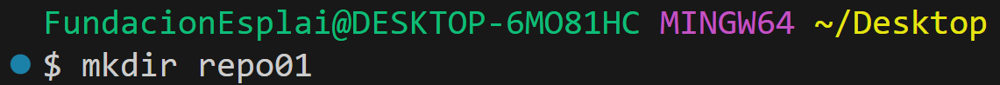
- Siguiente paso, accedemos dentro del **directorio** generado con cd *(nombre del directorio)*.
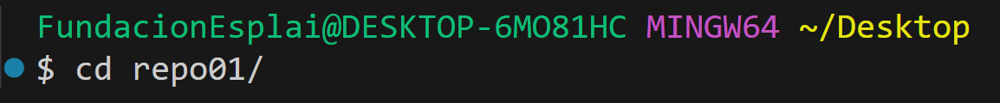
- Una vez dentro para generar un **repositorio local** utilizaremos git init dentro del mismo.
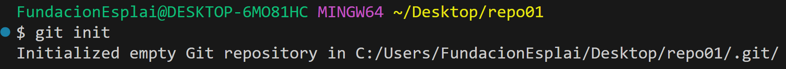
- Para comprobar si el repositorio es correcto escribiremos el comando **git status**.
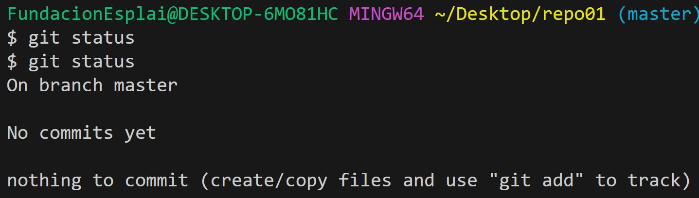

### 2. Estados de Repositorio 
- Al hacer un git add añadimos los cambios realizados al **staging area**.
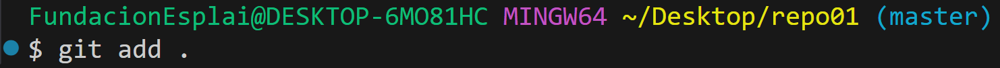
- Para comprobar si realmente está con **git status** podemos verlo.
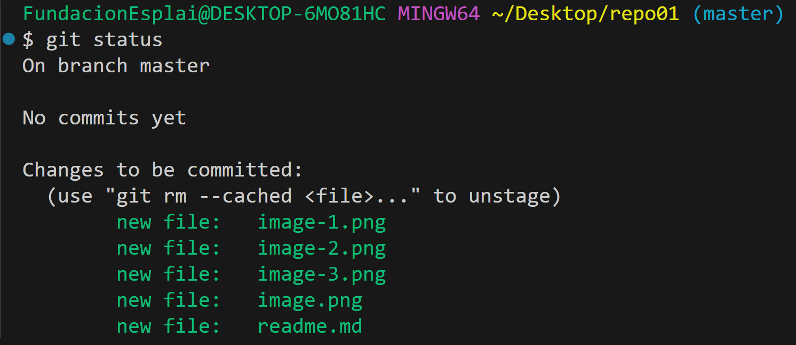
- Seguidamente creamos un snapshot utilizando git commit -m "(*descripción del progreso*)".
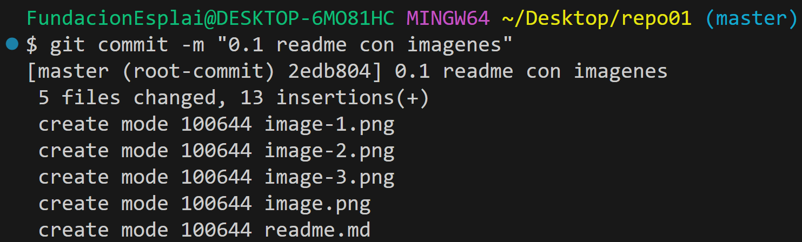
- En este momento el repositorio se encuentra en ***Commited***, si añadimos contenido dentro del fichero estará en ***Modified***, si hicieramos un **git add** estaría en ***staging area***.
### 3. Intentar subir ficheros al repostiorio remoto
* Aparece error y nos dice que no encuentra ningún repositorio.
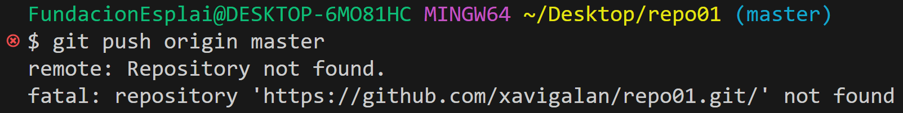
### 3. Sincronizar repositorio local con la nube
1. Primero crear un repositorio en la nube a través de **GIT HUB**.
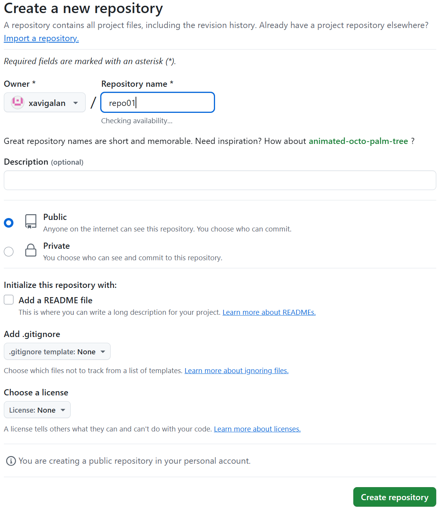
2. Sincronizar el repositorio local con el de la nube.
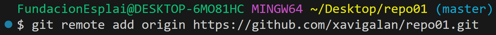

1. Y actualizar la rama de la nube con la local. Utilizaremos el **git push origin master** para ello.
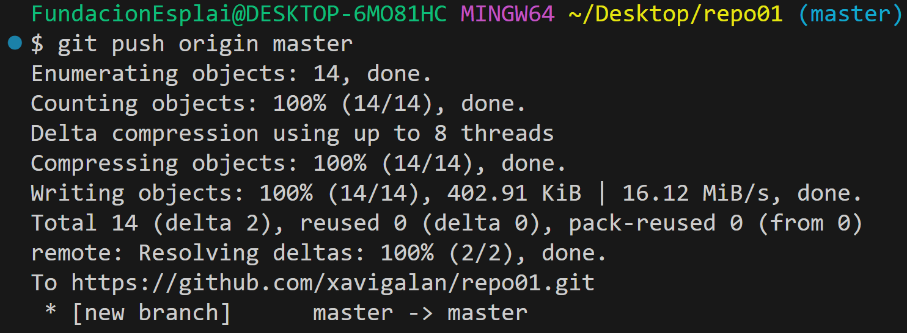
2. Comprobar commits en **github**.
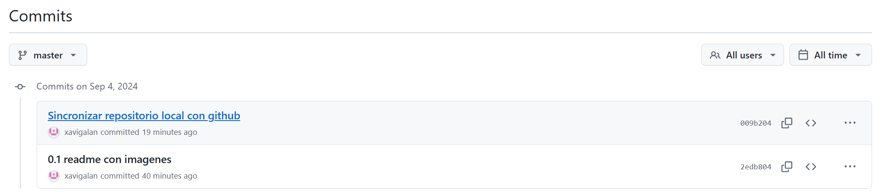
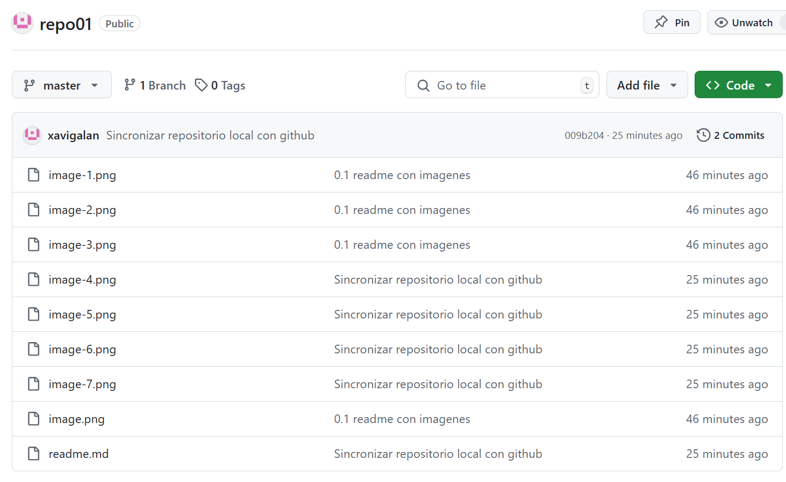
## EJERCICIO 2
1. Crea un repositorio llamado repo02 desde GitHub. ¿Sería considerado un repositorio
local o remoto?
És considerado remoto ya que **GitHub** és la nube.
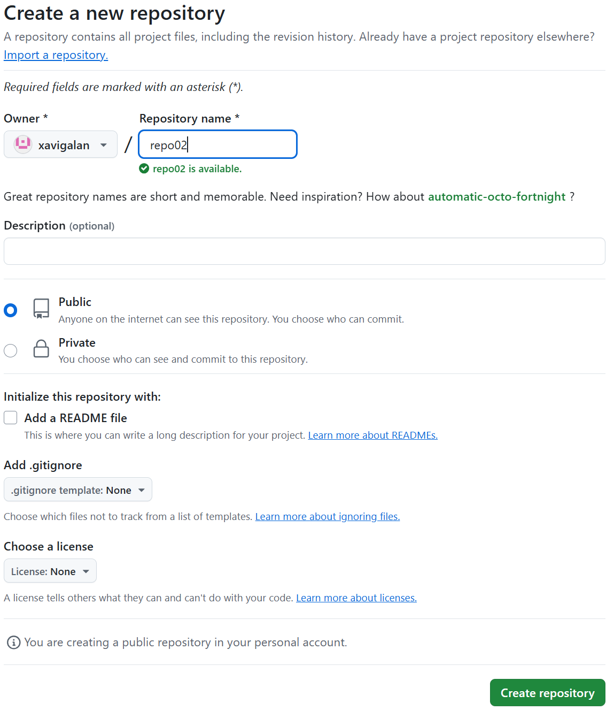
2. Posteriormente, clónalo (mediante al comando git clone), lo que realizará una copia
del repositorio remoto en nuestro equipo, creando con ello un repositorio local a partir del
repositorio en remoto
- Vamos al Escritorio y hacemos un **git clone https://github.com/xavigalan/repo02.git**
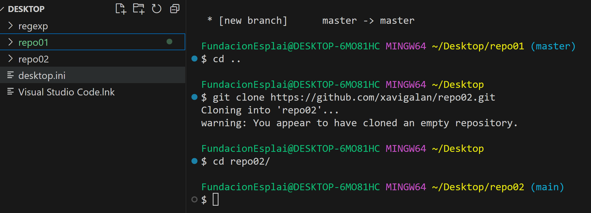
3. - Añade un fichero readme.md y ejecuta los comandos pertinentes hasta llegar a poder
realizar un commit.
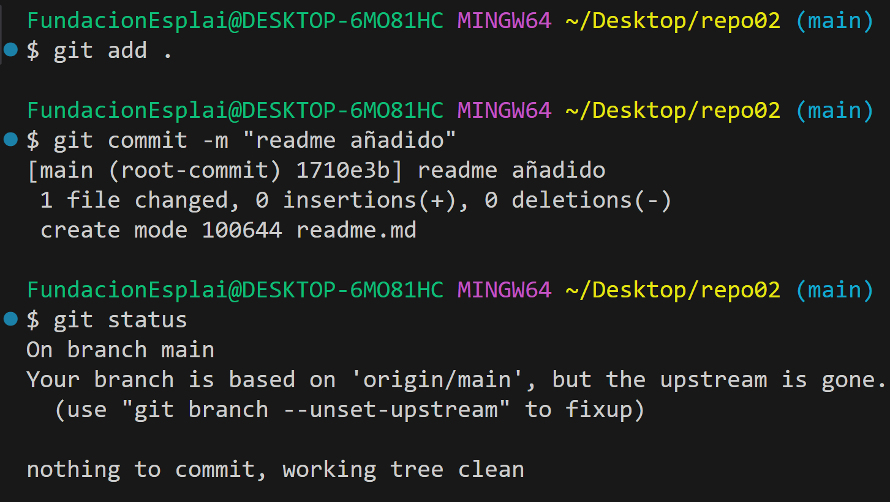
4. – Entra en este manual de Markdown y haz un resumen de los principales comandos de
Git con los que hemos trabajando. Puedes utilizar tablas, imágenes, títulos, enlaces, etc.
IMPORTANTE no subas todo el código de golpe, ya que es mejor que practiques los
conceptos.Por tanto, ves subiendo los cambios en distintas subidas a tu repositorio de
GitHub y comprobando que los cambios se visualicen correctamente.
## [RESUMEN MARDOWN](https://medium.com/@davidbernalgonzalez/3-markdown-c82d88c1d222)
### Puntos importantes MARKDOWN
- Encabezados tenemos de **h1** hasta **h6** utilizando la # a principio de la línea.
- Comentarios no apareceran en el markdown pero si en el fichero, para añadirlos hay varias formas pero por ejemplo <!-- HOLA ESTO ES UN COMENTARIO --> <!- - > son 2 guiones juntos al principio.
  * Listas para añadir listas a principio de cada frase con lo siguientes signos - * +, son distintos para poder separar las líneas e incluso sublistas.
- Enlaces/Links [BUENOS DÍAS](https://www.bing.com/ck/a?!&&p=91e193f8d3157c08JmltdHM9MTcyNTQwODAwMCZpZ3VpZD0xZDMyZTM1NC1jMWNkLTZkYTgtMzdiYy1mMDljYzBjYjZjNmMmaW5zaWQ9NTUxNw&ptn=3&ver=2&hsh=3&fclid=1d32e354-c1cd-6da8-37bc-f09cc0cb6c6c&u=a1L2ltYWdlcy9zZWFyY2g_cT1idWVub3MrZCVjMyVhZGFzJmlkPUY2RTZDMDExNzRFMzE1NjQ0RTk4MDk0MzFCQzBCMDQ4RDg1Q0YzRDgmRk9STT1JUUZSQkE&ntb=1) con [] es el texto a mostrar y seguido de esto () el enlace del texto.
- Separador de líneas con los siguientes signos *- en la parte inferior de la línea que separamos.

**PROBANDO **
***
**SEPARADOR**
* * *
- **IMÁGENES** para añadir imágenes sin enlace ![]  y si despues de ![] añadimos parentesis si veremos la imágen.

- **IMÁGENES** para añadir imágenes con enlace igual que la anterior pero añadiendo 
- **Tablas**
Así se veria para añadir la siguiente tabla.
|Header |Column 1 | Column 2 | Column 3  |
|:--- |:---- |:----:| ----:|
|1. Row| is | is | is  |
|2. Row| left | nicely | right  |
|3. Row| aligned | centered | aligned  |

|Header |Column 1 | Column 2 | Column 3  |
|:--- |:---- |:----:| ----:|
|1. Row| is | is | is  |
|2. Row| left | nicely | right  |
|3. Row| aligned | centered | aligned  |

